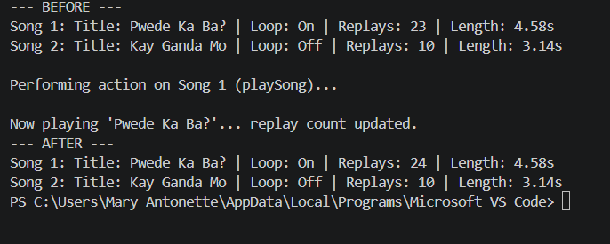

# Class Attributes and Methods

## Previous Design
Link to my previous activity:
[classObjectUML.md](classObjectUML.md)

## Design Revision
Describe any changes made to your original class.

## Visibility Decisions
| Attribute | Data Type | Visibility | Reason |
|---|---|---|---|
| title | string | Public | 	The song title needs to be freely read and displayed by other parts of the program. |
| loopSong | boolean | Public | The loop toggle is meant to be switched on/off directly, so it stays accessible. |
| replays | int | private | The replay count should only ever increase through the class's own logic. |
| songLength | float | private | A song's length is a fixed property of the audio file. It shouldn't be edited. |

## Updated UML Class Diagram
| ListeningStatistics |
|------|
| + title : string   |
| + loopSong : boolean |
| - replays : int |
| - songLength : float |
|---|
| + playSong() |
| + changeSong(title : string) |
| + displayStats() |
| + getReplays() |
|------|

## Python Implementation
[View Python Source](classImplementation.py)

## Test Run

## Object Diagram

## Analysis

### Why did you make your chosen attribute private?
I made replays private because it should only change through the class's own logic. If another part of the program could reassign replays, it could set an impossible value or reset the count without going through changeSong(), which would make the listening statistics unreliable.

### Which method changes the state of your object?
playSong() changes the state of the object by adding the __replays attribute by one each time it's called. changeSong() also changes state by updating the title and resetting __replays back to zero, since a new song hasn't been replayed yet.

### How did your two objects demonstrate that instances are independent?
During the test run, song1 started with 23 replays and song2 started with 10. After calling song1.playSong(), song1's replay count went up to 24, while song2 stayed at 10. This shows that even though both objects were built from the same ListeningStatistics class, each one keeps its own copy of the attributes.

### What is the difference between your class diagram and your object diagram?
The class diagram describes the blueprint of ListeningStatistics. It lists the attribute names, their data types, visibilities, and with the method signatures. The object diagram shows two specific instances, song1 and song2 with their real current values after the test run. So that it will show us actual data.

