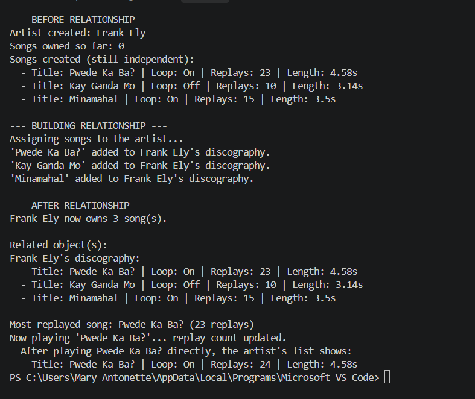

# Class Relationships: Association and Multiplicity
## Previous Work
[Part I - Classes and Objects](classObjectUML.md)
[Part II - Class Attributes and Methods](classAttributesMethods.md)

## Existing Class
Class: Listening Statistics 
Description: It represents a song and tracks its playback behavior.

## New Related Class
Class: SongArtist
Description: It represents the musician or band who creates the songs.

## Association
Relationship: SongArtist owns ListeningStatistics
Explanation: Every song is created by an artist, so an Artist object needs to store and manage the ListeningStatistics objects that make up their discography.

## Multiplicity
Multiplicity: 1 : 0..*
Explanation: One artist can own zero or more songs, while each song in this system belongs to a single artist.

## UML Class Relationship Diagram

## Python Implementation
[View Python Source](classRelationships.py)
## Test Run

## Object Relationship Diagram

## Analysis
### What is the association between your two classes?
The Artist class owns a group of ListeningStatistics objects. It stores each song created by that artist and can perform actions across the collection, such as displaying the full discography or finding the most replayed song. This reflects a "has-a" relationship, since an artist's identity is built from the songs they've released.
### What multiplicity did you choose and why?

### How did you implement the relationship in Python?

### Why did you store an object reference instead of copying its data?

### If your relationship uses many, why is a list appropriate?
